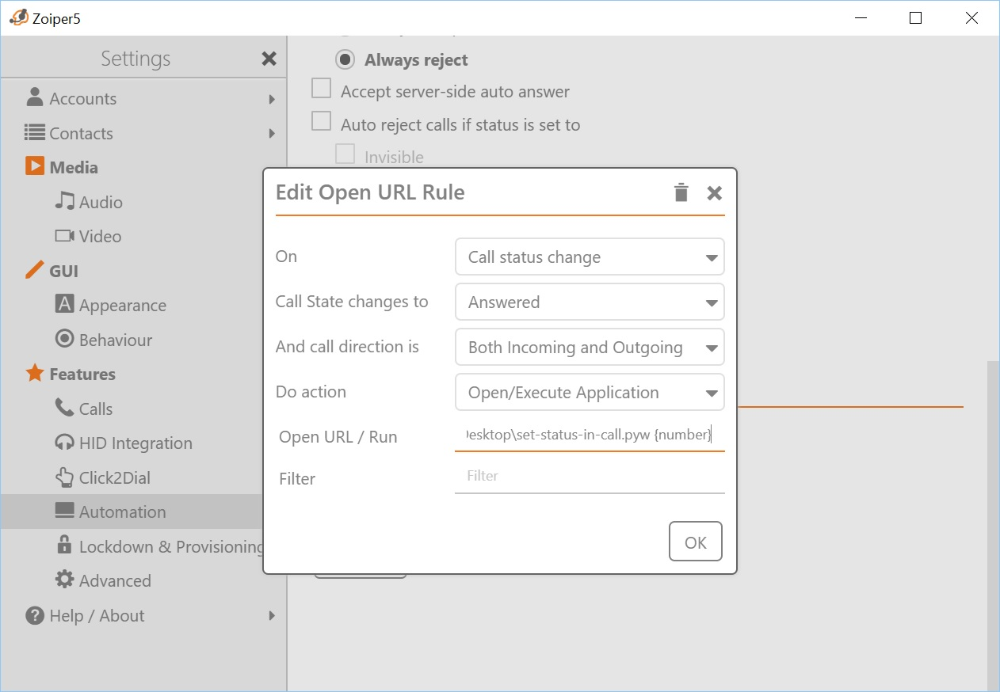
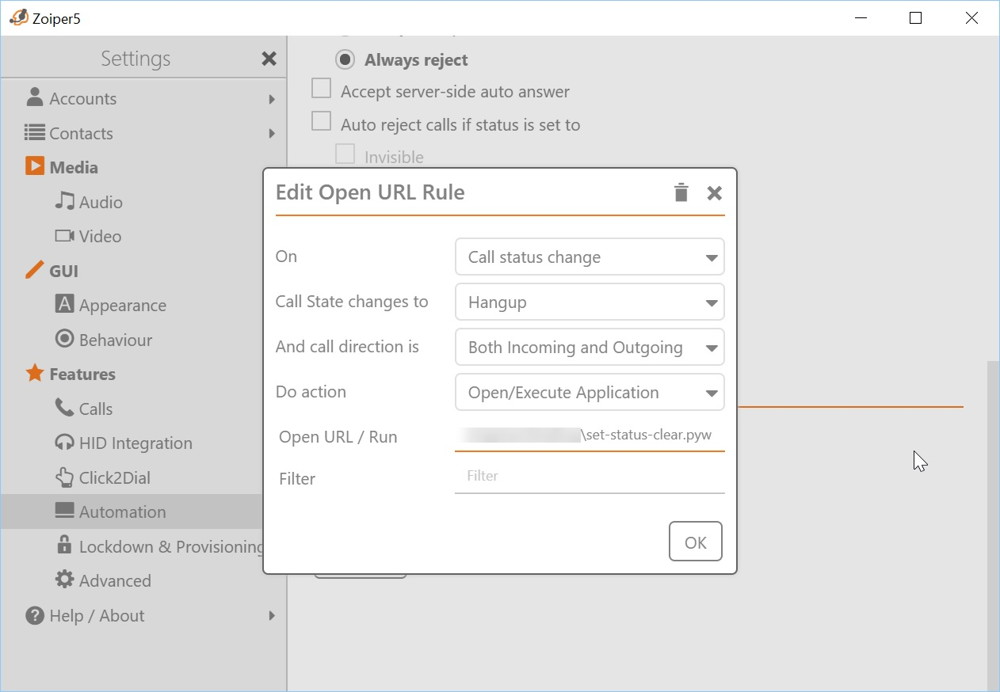

# zoiper-slack-status

## Overview

I wanted a simple way of having my Slack status automatically update when I take a phone call using Zoiper. The majority of VoIP handsets or softphones support the opening of a URL during a certain event such as picking up or ending a call - which can be leveraged for various uses as you can imagine. Zoiper supports this method, but also has ability to execute files/applications on such events. In this particular project, when a phone call is answered Zoiper will launch ```set-status-in-call.pyw``` and pass the incoming caller ID using ```{number}``` which is one of a few supported Zoiper variables.


[Full list of Zoiper variables here](https://www.zoiper.com/en/support/home/article/193/Open%20URL%20or%20application%20opening%20on%20phone%20event)

If an incoming call from 0212345678 is answered, then the Slack status will change to ```Currently in a call with 0212345678``` with the ```telephone_reciever``` emoji set.

Once the call is hung up, Zoiper will launch ```set-status-clear.pyw``` on that particular event which then clears the Slack status out.

The use of the ```.pyw``` extension will make the code execute in the background instead of popping up a command window or similar - as you'll see if running this on Windows.

## Setup

1. You'll want to install Python on your device. This has been tested using Python v3.6.x but should be fine with ~v2 if you're using that.
2. You will need the Python "requests" module which can be installed with ```pip install requests```

3. You will need your Slack API token. At the time of writing it's possible to grab this by logging into the Slack via your web browser and then using the developer tools in your web browser to perform inspections when making a change such as updating your status. You should be able to comb through and grab your API token - further information on doing this is outside of the scope of this documentation. Once you have your API token, replace the ```YOUR_SLACK_TOKEN_GOES_HERE``` variable with your actual token.

4. Setup your Zoiper client as per the following screenshots. In Zoiper5 you can add Event Rules under ```Settings > Features > Automation > Edit Open URL Rule```

#### Create a rule for when the call state changes to ```Answered``` and point it to ```set-status-in-call.pyw {number}```



#### Create a rule for when the call state changes to ```Hang Up``` and point it to ```set-status-clear.pyw {number}```



### Modify to your desire!
